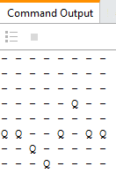
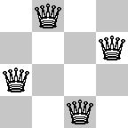

# Simulated Annealing



### Introduction

The N-queens problem is to place N queens on an N-by-N chess board so that none are in the same row, the same column, or the same diagonal. For example, if N=4, this is a solution:



In this assignment, we'll use simulated annealing to figure out a solution to the n-queens problem.

This homework is similar to the BFS maze assignment, so before you begin, make sure that you are still completely comfortable with classes and methods in python, and the idea of instances.

Recall the basic algorithm for simulated annealing:

```
simulated-annealing(initial solution)
let solution be initial
let t be an initial temperature
until t is almost zero
    let neighbor be a random neighbor of solution
    if the cost of neighbor is less than the cost of solution
        let solution be neighbor
        stop if the cost is now 0
    otherwise
        let c be the cost increase
        compute p = e^(-c/t)
        with probability p, let solution be neighbor
    multiply t by a decay rate
return solution
```

## Implementation

A `Board` class and an `Agent` class have been started for you below. Once you complete the indicated methods, you will be able to watch a random board initial solution being annealed. Adjust the height of your console window to match the board height, so that each display appears in the same place.

After completing the three methods marked "YOU FILL THIS IN", your `nqueens.main` driver method 
should work. Simulate the maze by executing the `main` (similar to HW0).

**Algorithm notes:**

- In simulating annealing, you decide on a cost function that decreases towards 0 as the board gets closer to a solution. In this assignment, you will implement a `cost` function that returns the number of attacking queens for a board instance. For this assignment, each attack will count as "+2" since there are 2 queens attacking each other.
- In simulating annealing, you alos need to decide what types of moves to allow and how to represent them. For this assignment, at each iteration, we'll allow 1 queen on the board to move to a row different than what it is already in.
- Simulating annealing is a local search with space complexity O(1). A path from the start to the goal is not typically returned. However, in this assignment, we'll return a path for console display purposes and consistency with the previous programming assignments.
- You may need to try a few values for the initial temperature (e.g. 1, 10, 100), the stopping threshold (e.g. 0.1, 0.01, 0.001), and the decay rate (e.g. 0.9, 0.99, 0.999) to find an effective combination.


## Autograding / Testing

Keep your n-queens implementation program named `nqueens.py`. 

There are four functions that I'll be testing. Initial board configurations in the testing file include 4x4, 6x6, 8x8 boards.

1. `moves`(4 x 3 pts = 12 pts)
2. `neighbor`(2 x 6 pts = 12 pts)
3. `cost` (6 x 3 pts = 18 pts) 
4. `anneal`(3 x 11 pts = 33 pts)

The pytest methods are located in `test_nqueens.py`. Execute the pytests the same as HW0. Feel free to 
include additional tests as long as you don't overwrite my original tests.

### Held-Out Tests

I will also run your code agaist the above testing methods for 25 points of additional test cases following the submission of your assignment, after the deadline. Be sure to check your program against additional test cases that you develop. Feel free to collaborate on our course discussion board with ideas about your additional tests.

## Submission Instructions

Push your completed program to your GitHub. Verify the success of the autograding GitHub Action, exactly like HW 0. Test your project locally using pytest before pushing/committing. You may push/commit multiple times. Look at the Actions report on the repository to double check the most recent result of the unit tests.

<!---
## Acknowledgements

The initial structure for this assignment was motivated by Lisa Torrey's 2016 Model AI Assignments contribution.
--->
